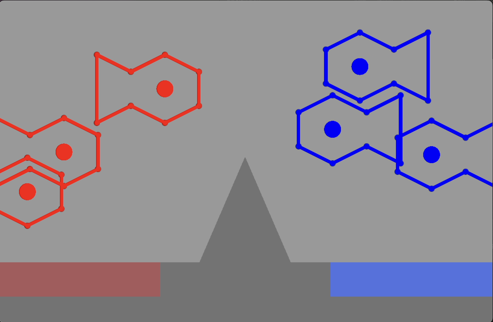

# Leaping Fish Verlet Unity Assignment

Created for COMP 521 - Modern Computer Games. Made using Unity/C#.

Watch a demo [here](https://www.youtube.com/watch?v=V70TlsH6XvI&ab_channel=Lian)!

Requirements included:
1. Two ponds separated by an obstacle, with fish launched between them
2. All movement and collision detection must be hand-coded (no using built-in physics)
3. Launched fish follow a random parabolic arc aimed at the opposite pond, angle and velocity should be randomly generated
4. Fish collide only through their eyes (with other eyes, the ground, and the obstacle)
5. Fish bodies are modeled using Verlet integration to enforce shape constraints
6. Fish bodies should adjust to not penetrate the ground

### Controls:
- **Keyboard:** Press 1 to launch a fish from the left side and 2 to launch a fish from the right

### Screenshots:

